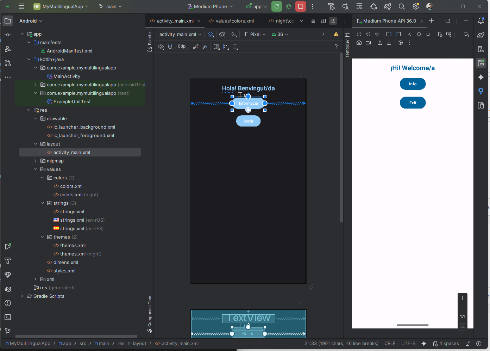
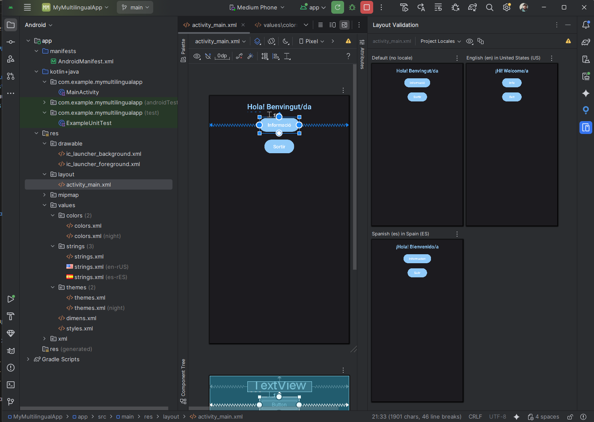
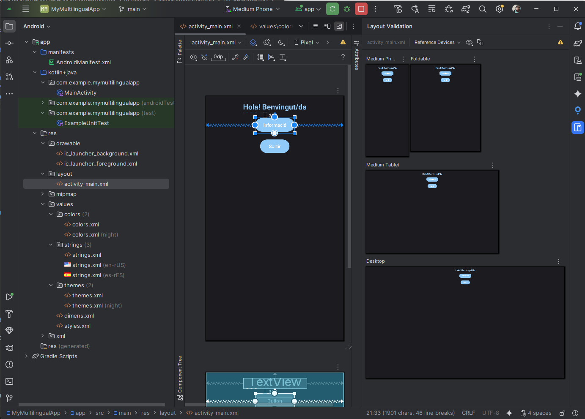

# 🌍 My Multilingual App

Aplicació Android multillenguatge desenvolupada en **Kotlin** amb **Android Studio Narwhal 3 Feature Drop | 2025.1.3**.
Forma part del mòdul **DAM0489 – Programació multimèdia i dispositius mòbils**.

## 🚀 Funcionalitats

* Interfície senzilla amb **ConstraintLayout**.
* Suport complet per a **traduccions** (ca, es, en).
* Mostra un **Toast** amb missatge multillenguatge.
* Estils amb **Material Design 3 (M3)**.
* Temes **Day/Night** amb colors diferenciats.
* Botó per **tancar l’aplicació**.

---

## 🛠️ Tecnologies utilitzades

* **Kotlin**
* **Android Studio 2025.1.3**
* **Material Design 3**
* **ConstraintLayout**
* Fitxers de recursos XML:

  * `strings.xml`
  * `styles.xml`
  * `colors.xml`
  * `themes.xml`
  * `dimens.xml`

---

## 📂 Estructura del projecte

```
app/
└── src/
    └── main/
         ├── java/com/example/mymultilingualapp/MainActivity.kt
         ├── res/
         │     ├── layout/activity_main.xml
         │     ├── values/strings.xml
         │     ├── values-es/strings.xml
         │     ├── values-en/strings.xml
         │     ├── values-ca/strings.xml
         │     ├── values/colors.xml
         │     ├── values-night/colors.xml
         │     ├── values/dimens.xml
         │     ├── values/styles.xml
         │     └── values/themes.xml
```

---

## 📱 Pantalla principal

L’aplicació conté:

* Un **TextView** amb el títol (multillenguatge).
* Un botó **Informació** → mostra un Toast.
* Un botó **Sortir** → tanca l’activitat.

---

## 👨‍💻 Codi principal (MainActivity.kt)

```kotlin
class MainActivity : AppCompatActivity() {

    override fun onCreate(savedInstanceState: Bundle?) {
        super.onCreate(savedInstanceState)
        setContentView(R.layout.activity_main)

        val txtTitle = findViewById<TextView>(R.id.txtTitle)
        val btnInfo = findViewById<Button>(R.id.btnInfo)
        val btnExit = findViewById<Button>(R.id.btnExit)

        btnInfo.setOnClickListener {
            Toast.makeText(
                this,
                getString(R.string.hello_message),
                Toast.LENGTH_SHORT
            ).show()
        }

        btnExit.setOnClickListener {
            finish()
        }
    }
}
```

---

## 🎨 Disseny XML (activity_main.xml)

Inclou estils de Material 3 i marges definits a **dimens.xml**.

```xml
<androidx.constraintlayout.widget.ConstraintLayout ...>

    <TextView
        style="@style/TitleText"
        android:id="@+id/txtTitle"
        android:text="@string/hello_message"
        ... />

    <Button
        android:id="@+id/btnInfo"
        style="@style/AppButton"
        android:text="@string/btn_info"
        ... />

    <Button
        android:id="@+id/btnExit"
        style="@style/AppButton"
        android:text="@string/btn_exit"
        ... />

</androidx.constraintlayout.widget.ConstraintLayout>
```

---

## 🌓 Mode Day/Night

L’app utilitza el parent:

```
Theme.Material3.DayNight.NoActionBar
```

Això permet que Android seleccioni automàticament els colors segons:

* **Tema clar** → `values/colors.xml`
* **Tema fosc** → `values-night/colors.xml`

### Exemple de colors

#### ☀️ values/colors.xml

```xml
<color name="md_theme_primary">#00629B</color>
```

#### 🌙 values-night/colors.xml

```xml
<color name="md_theme_primary">#90CAF9</color>
```

### ✔ Com revisar el tema Night al Layout Editor

1. Obre `activity_main.xml`
2. A la barra superior del Preview, fes clic a **Light / Dark**
3. Pots validar instantàniament com es veu cada tema

---

## 🌐 Strings multillenguatge

### Català (`values-ca/strings.xml`)

```xml
<string name="btn_info">Informació</string>
<string name="btn_exit">Sortir</string>
```

### Castellà (`values-es/strings.xml`)

```xml
<string name="btn_info">Información</string>
<string name="btn_exit">Salir</string>
```

### Anglès (`values-en/strings.xml`)

```xml
<string name="btn_info">Info</string>
<string name="btn_exit">Exit</string>
```

---

## 🧪 Layout Validation

Android Studio inclou una eina molt potent: **Layout Validation**, que permet revisar:

### ✔ Idiomes

Com es veu l’app en **català, castellà i anglès** en paral·lel.

### ✔ Mides de pantalla

* Mòbil petit
* Mòbil mitjà
* Tablet
* Dispositiu plegable
* Pantalla de sobretaula (Desktop Mode)

Això és essencial en el mòdul DAM0489, ja que l’alumnat ha d’aprendre a validar accessibilitat, responsivitat i localització.

---

## 🖼️ Captures de pantalla

### 1️⃣ Resultat final al simulador



---

### 2️⃣ Layout Validation – Idiomes



---

### 3️⃣ Layout Validation – Mides de pantalla



---

## 🎭 Temes (themes.xml)

```xml
<style name="Theme.MyMultilangApp" parent="Theme.Material3.DayNight.NoActionBar">
    <item name="colorPrimary">@color/md_theme_primary</item>
    <item name="colorSecondary">@color/md_theme_secondary</item>
</style>
```

---

## ▶️ Com executar l’app

1. Clona el repositori:

```bash
git clone https://github.com/alsalgom88/GS_DAM_0489/tree/main/Tema1FonamentsDesenvolupamentMobil/Activitats/MyMultilingualApp
```

2. Obre’l amb **Android Studio 2025.1.3**
3. Executa’l en un emulador o dispositiu físic

---

## 📝 Llicència

MIT License.

---